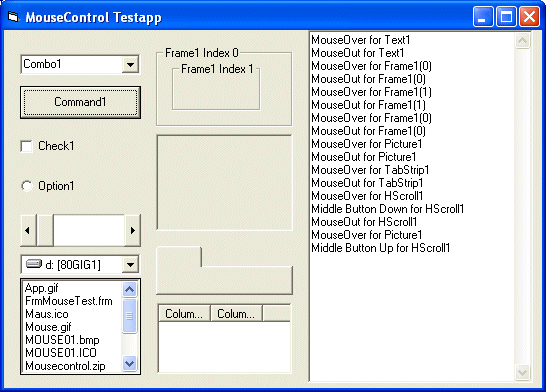



## Mouscontrol the hWnd way

### Description

A control to get Mouse Over,Out,Middle Button &amp; Wheel for any control with hWnd.
 
### More Info
 

             |
---                |---
**Submitted On**   |2005-08-05 17:32:06
**By**             |[Scythe](https://github.com/Planet-Source-Code/PSCIndex/blob/master/ByAuthor/scythe.md)
**Level**          |Advanced
**User Rating**    |4.0 (16 globes from 4 users)
**Compatibility**  |VB 5\.0, VB 6\.0
**Category**       |[Custom Controls/ Forms/  Menus](https://github.com/Planet-Source-Code/PSCIndex/blob/master/ByCategory/custom-controls-forms-menus__1-4.md)
**World**          |[Visual Basic](https://github.com/Planet-Source-Code/PSCIndex/blob/master/ByWorld/visual-basic.md)
**Archive File**   |[Mouscontro201877982006\.zip](https://github.com/Planet-Source-Code/scythe-mouscontrol-the-hwnd-way__1-66506/archive/master.zip)

